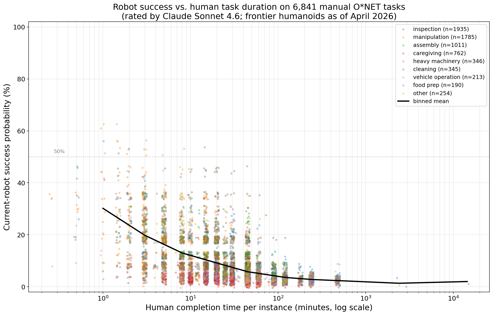
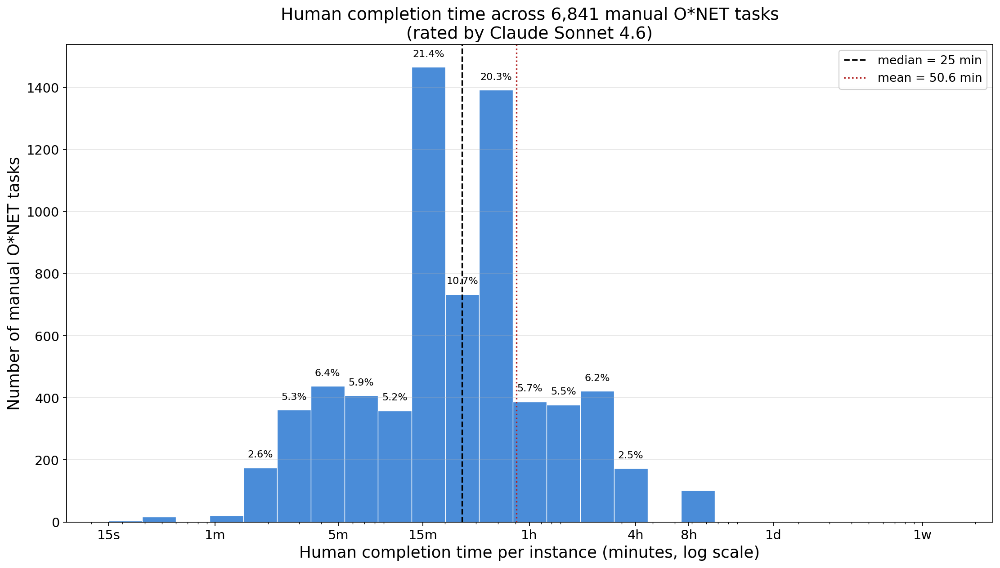

# robotics-task-horizon

A dataset and methodology for measuring **current-robot success rates vs. human task duration** on manual O\*NET occupational tasks — a robotics-side companion to Mertens et al. (2026) *Crashing Waves vs. Rising Tides*, which studied the LLM side.

## Headline result

Across **6,841 manual O\*NET tasks**, there is a clean monotonically negative success–duration relationship: the longer a task takes a human, the less likely a frontier 2026 humanoid / mobile manipulator can complete it autonomously.





Human task-time distribution: strongly bimodal-ish on the log axis, peaking at ~15–45 min (median 25 min, mean 50.6 min), with a long right tail up to ~1 week.

Binned mean robot success (Claude Sonnet 4.6 ratings, frontier humanoid reference class as of April 2026):

| Human time per instance | n tasks | Mean robot success |
| --- | --- | --- |
| ~1 min | 38 | 30% |
| ~3 min | 536 | 20% |
| ~8 min | 1,141 | 13% |
| ~20 min | 2,263 | 9% |
| ~45 min | 1,780 | 6% |
| ~2 hr | 800 | 3.6% |
| ~4 hr | 275 | 2.8% |
| 1 day+ | 4 | ~1.5% |

This is the robotics-side analog of the LLM success–duration curve in Mertens et al. 2026 — but it is **much steeper** and overall much lower. Only 19 / 6,841 tasks (0.3%) exceed 50% success; 3,421 / 6,841 (50%) are at 5% or below.

## Motivation

Mertens et al. (2026) asked: across text-based labor-market tasks, how does LLM success scale with the time a human would need? They screened O\*NET tasks with GPT-4 for ≥10% LLM time-savings potential and found an approximately "rising tide" (flat-slope) success–duration curve.

Their screen was a **usefulness** criterion on text-based tasks. This project asks a parallel question on a different axis: for O\*NET tasks whose primary execution is **physical / manual** (the domain robots, not LLMs, must tackle), how do frontier humanoid / mobile-manipulator robots perform vs. human task duration?

This is not the logical inverse of the reference paper — their filter is time-savings-based, ours is modality-based — but it uses the same O\*NET task universe and is designed to let a similar analysis be run on the robotics side.

## Data

Source: O\*NET Task Statements (`data/onet/Task Statements.txt`, 18,796 tasks across 923 SOC codes).

After modality classification: **6,841 manual** (36%) vs **11,955 text-based** (64%).

## Pipeline

1. **Classify** every O\*NET task as *manual* (physical execution required) vs. *text-based* (cognitive / verbal / written / planning / supervisory). Claude Haiku 4.5, 200-way async, tool-forced structured output, prompt-cached system prompt, resumable.
   - Script: `src/classify_manual.py`
   - Output: `outputs/classifications.tsv`

2. **Filter and sample.** Keep `is_manual=True` → `outputs/manual_tasks.tsv` (6,841 rows). Draw a seeded sample of 100 (`seed=42`) → `outputs/manual_tasks_sample100.tsv`.
   - Script: `src/filter_and_sample.py`

3. **Rate.** For each task, Claude Sonnet 4.6 assigns:
   - `task_category` — short label (manipulation, inspection, assembly, caregiving, cleaning, heavy machinery, vehicle operation, food prep, locomotion, …).
   - `human_time_minutes` — median time for a competent human to complete one instance, with rationale.
   - `robot_success_prob` (0–100) — probability a best-available 2026 general-purpose mobile manipulator / humanoid could complete one instance autonomously at acceptable quality, with rationale.
   - Script: `src/rate.py` (resumable; takes `RATE_MODEL` and `RATE_INPUT` env vars).
   - Output: `outputs/manual_tasks_rated_sonnet_4_6.tsv` (full), `outputs/manual_tasks_sample100_rated_sonnet_4_6.tsv` (sample), `outputs/manual_tasks_sample100_rated_haiku_4_5.tsv` (Haiku comparison on the sample).

4. **Sort and plot.**
   - `src/sort_by_time.py` → `outputs/manual_tasks_rated_by_time.tsv` (sorted ascending by human time).
   - `src/plot.py` → `plots/human_time_vs_robot_prob.png` (scatter w/ jitter + binned-mean curve).
   - `src/plot_histogram.py` → `plots/human_time_histogram.png`.

## Reproduce

```bash
uv sync
uv run python src/classify_manual.py                     # ~4.5 min, ~$5 Anthropic spend
uv run python src/filter_and_sample.py                   # instant
RATE_INPUT=outputs/manual_tasks.tsv uv run python src/rate.py  # ~3 min, ~$55 Anthropic spend
uv run python src/sort_by_time.py
uv run python src/plot.py
```

Requires `ANTHROPIC_API_KEY` in `.env` (note: `python-dotenv` is called with `override=True` because shell env may hold a stale key).

## Summary statistics

**Full manual-task ratings** (`outputs/manual_tasks_rated_sonnet_4_6.tsv`, n = 6,841):

| Metric | Value |
| --- | --- |
| Human time p25 / median / p75 | 10 / 25 / 45 min |
| Human time min / max | 0.25 min (15 s) / 14,400 min (10 d) |
| Robot success min / median / mean / max | 0.5% / 5% / 9.0% / 62% |
| Tasks with robot_success ≥ 50% | 19 (0.3%) |
| Tasks with robot_success ≥ 30% | 292 (4.3%) |
| Tasks with robot_success ≤ 5% | 3,421 (50.0%) |

**By task category** (n ≥ 50 only):

| Category | n | Mean robot success | Median human time |
| --- | ---: | ---: | ---: |
| inspection | 1,935 | 9.2% | 30 min |
| manipulation | 1,785 | 11.3% | 15 min |
| assembly | 1,011 | 7.8% | 45 min |
| caregiving | 762 | 3.8% | 20 min |
| heavy machinery | 346 | 3.7% | 45 min |
| cleaning | 345 | 16.6% | 25 min |
| vehicle operation | 213 | 3.6% | 45 min |
| food prep | 190 | 11.6% | 10 min |
| locomotion | 128 | 10.3% | 25 min |

Cleaning and simple manipulation are the easiest categories on average; caregiving (heavy medical component), heavy-machinery operation, and vehicle operation are the hardest.

**Extremes** (from `outputs/manual_tasks_rated_by_time.tsv`):

Highest-success tasks: pick-and-place of workpieces (62%), sort products by weight/size (55%), sweep floors (55%), press machine-control buttons (52%).

Lowest-success tasks among the ≥30-minute bucket: virtually all surgical / dental / prenatal / anesthesia procedures (0–1%); pipe-organ installation; restaging of choreographed dance works.

## Rater comparison (sanity check on the sample)

We rated the 100-task sample with both Sonnet 4.6 and Haiku 4.5 to check calibration:

| | Sonnet 4.6 | Haiku 4.5 |
| --- | ---: | ---: |
| Mean robot success | 9.3% | 22.4% |
| Median robot success | 8% | 25% |
| Per-task Spearman ρ (robot success) | — | **0.75** vs Sonnet |
| Per-task Spearman ρ (human time) | — | **0.80** vs Sonnet |

Haiku ranks tasks similarly to Sonnet but is systematically ~13 pp more optimistic about current-robot capability — it tends to give moderate scores to manipulation / assembly tasks that Sonnet rates near floor. We use Sonnet 4.6 as the reported rater.

25 of the 6,841 tasks triggered `stop_reason=refusal` mid-tool-call on Sonnet 4.6 (hazmat transport, medical procedures, chemical spraying). These 25 were filled via Haiku 4.5 fallback; they are <0.4% of the sample and do not materially shift the aggregate statistics.

## Methodology notes

**Definition of "manual"** (modality, not LLM time-savings):
> A task is **manual** iff its primary execution requires physical manipulation of tangible objects, operation of physical tools / machinery / vehicles, bodily movement, or on-site physical presence to interact with the physical world.

Supervisory, planning, and communicative tasks are classified as **text-based** even when they occur in traditionally "blue-collar" SOC families (e.g. "Supervise construction workers" → text-based; "Load cargo onto trucks" → manual). Full definition with edge cases in `src/classify_manual.py`.

**Definition of "current robot"** (for success-probability ratings):
> Best-available 2026 general-purpose mobile manipulator / humanoid — e.g. Figure 02, 1X Neo Gamma, Tesla Optimus Gen 3, Boston Dynamics Atlas (electric), Unitree H1 / G1, Agility Digit, Apptronik Apollo — deployed commercially or in advanced pilots. **Excludes**: task-specific research demos, teleoperation, narrow industrial arms on fixed fixtures.

Capability anchors used to calibrate the rater are in `src/rate.py` (includes explicit prob ranges for pick-and-place, folding laundry, driving vehicles, fine dexterous work, caregiving, cooking, cleaning, assembly, etc.).

**Sample seed**: `42` (Python `random.Random`).

**Models**:
- Classification: `claude-haiku-4-5`
- Rating: `claude-sonnet-4-6` (with `claude-haiku-4-5` fallback on 25 refusals)

## Output schemas

`outputs/classifications.tsv`:
| column | type | description |
| --- | --- | --- |
| task_id | str | O\*NET Task ID |
| soc_code | str | O\*NET-SOC code |
| task | str | task statement |
| is_manual | bool | classification outcome |
| rationale | str | ≤25-word justification |

`outputs/manual_tasks.tsv`: same columns, filtered to `is_manual=true`.

`outputs/manual_tasks_sample100.tsv`: same columns, seeded sample of 100.

`outputs/manual_tasks_rated_sonnet_4_6.tsv` (and `..._rated_by_time.tsv`, and sample variants):
| column | type | description |
| --- | --- | --- |
| task_id | str | |
| soc_code | str | |
| task | str | |
| task_category | str | |
| human_time_minutes | float | |
| human_time_rationale | str | |
| robot_success_prob | float | 0–100 |
| robot_success_rationale | str | |

## Relationship to the reference paper

| | Mertens et al. 2026 | This project |
| --- | --- | --- |
| Domain | LLM automation | Robot automation |
| Filter axis | Time-savings ≥10% (GPT-4 screen) | Modality = physical (Haiku 4.5 screen) |
| Rater | Human workers evaluating 40+ LLMs | Claude Sonnet 4.6 (seed dataset; human eval is future work) |
| Task source | O\*NET | O\*NET |
| Outcome | Manager-acceptable completion without edits | Autonomous completion at acceptable quality |
| Shape of success–duration curve | Flat ("rising tide") | Clearly negative, much steeper |

The two filters overlap but are not complementary: some text-based tasks have <10% LLM time savings; some manual tasks also have text components. This dataset targets the **physical** slice specifically.

## Limitations

- **LLM rater, not human rater.** All success probabilities are Claude Sonnet 4.6's judgments against capability anchors specified in the system prompt. Human expert ratings are future work.
- **Reference-class drift.** "Current robot" = frontier general-purpose humanoid / mobile manipulator as of April 2026. Estimates will age; re-rating with a new anchor set is part of the intended workflow.
- **Per-instance interpretation.** Ratings are for *one* instance of a task (e.g. one patient, one room, one shipment), not aggregate throughput or multi-day campaigns.
- **Sonnet refusals.** 25 tasks (hazmat / medical) were filled via Haiku fallback; Haiku is ~13 pp more optimistic. Aggregate impact is <0.05 pp on mean robot success, but individual rows may look slightly rosy.
- **O\*NET task wording.** O\*NET tasks are often abstracted descriptions of activities, not specific instances. "Typical" instance assumptions are encoded in each rationale.

## Reference

Mertens, M., Kuzee, A., Harris, B. S., Lyu, H., Li, W., Rosenfeld, J., Anto, M., Fleming, M., Thompson, N. (2026). *Crashing Waves vs. Rising Tides: Preliminary Findings on AI Automation from Thousands of Worker Evaluations of Labor Market Tasks.* arXiv:2604.01363. PDF in `reference/`.
